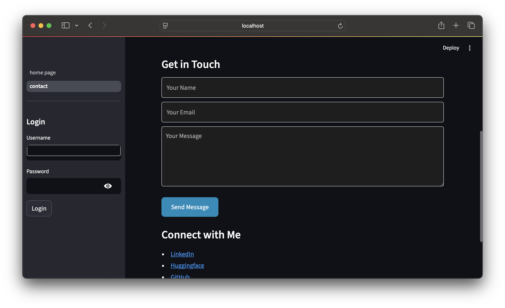

---

# Streamlit App with Basic Authentication

This is a multi-page Streamlit application featuring a basic authentication system. The app includes:

* **Home Page**: Public access
* **Dashboard**: Private, authenticated access
* **Settings**: Private, authenticated access
* **Contact**: Public access with a contact form

## Features

* **Authentication**: Users can log in using predefined credentials stored in a CSV file.
* **Session Management**: Sessions expire after a set period, requiring re-login.
* **Page Navigation**: Conditional navigation based on authentication status.
* **Contact Form**: A simple contact form for user inquiries.

## Installation

1. Clone the repository:

   ```bash
   git clone https://github.com/eaedk/st-app-with-basic-authentification.git
   ```

2. Navigate to the project directory:

   ```bash
   cd st-app-with-basic-authentification
   ```

3. Install the required dependencies:

   ```bash
   pip install -r requirements.txt
   ```

4. Run the Streamlit app:

   ```bash
   streamlit run app.py
   ```

## File Structure

```
.
├── _pages
│   └── contact.py        # Contact page with a form
├── app.py                # Main Streamlit application file
├── data
│   └── secret
│       └── users.csv     # CSV file containing user credentials
├── Dockerfile            # Docker configuration for deploying the app
├── images                # Folder containing app images
│   ├── contact_bottom.png
│   ├── contact_top.png
│   ├── dashboard.png
│   ├── home.png
│   ├── login.png
│   └── settings.png
├── requirements.txt      # Python dependencies
└── src
    ├── auth.py           # Authentication logic
    ├── config.py         # Configuration variables (e.g., users CSV path)
    └── __init__.py       # Initialization file for the 'src' package
```

## How It Works

1. **User Management**: Users are stored in a CSV file (`users.csv`) with the username and password fields. The app reads this file on the first run and creates a dummy set of users if the file does not exist.

2. **Login Process**: The app provides a login form in the sidebar. Once users input their credentials, the app checks against the `users.csv` file. If the credentials are valid, the user is authenticated, and a session is created.

3. **Session Expiry**: The user’s session expires after a configurable period (e.g., 2 days). The app automatically logs out the user when the session expires and asks them to log in again.

4. **Private Pages**: Authenticated users have access to private pages such as the **Dashboard** and **Settings**, while unauthenticated users only have access to the public **Home** and **Contact** pages.

5. **Navigation**: The app includes dynamic page navigation. Authenticated users can access the **Dashboard** and **Settings** pages, while others can only view the **Home** and **Contact** pages.

## Authentication

* **Users File**: The file where user credentials are stored is defined in `src/config.py` under the `USERS_CSV_FILE` variable. The default is `data/secret/users.csv`.

* **Session Management**: The app checks if the user is authenticated at the beginning of each session. If the session is expired, it forces the user to log in again.

## Pages

* **Home Page**: Public page accessible to everyone. It prompts users to log in to access restricted content.

* **Dashboard**: Private page with personalized content and data visualizations. Accessible only by authenticated users.

* **Settings**: Private page where authenticated users can adjust settings (e.g., volume slider, notification checkbox).

* **Contact**: Public page with a contact form for user inquiries.

## Configuration

1. **Users File**: The file where user credentials are stored is defined in `src/config.py` under the `USERS_CSV_FILE` variable. The default is `data/secret/users.csv`.

2. **Session Validity**: The session expiration is managed by the `check_session_validity()` function in `src/auth.py`. You can adjust the validity period by changing the `VALIDITY_PERIOD_DAYS` and `VALIDITY_PERIOD_MINUTES` in `config.py`.

## Docker Setup (Optional)

The app also includes a `Dockerfile` to containerize the application. To run the app in a Docker container:

1. Build the Docker image:

   ```bash
   docker build -t streamlit-auth-app .
   ```

2. Run the Docker container:

   ```bash
   docker run -p 8501:8501 streamlit-auth-app
   ```

3. Access the app at `http://localhost:8501`.

## Screenshots

* **Home Page**: 
* **Login Page**: 
* **Dashboard**: 
* **Settings Page**: 
* **Contact Page**:  

## License

This project is licensed under the MIT License - see the [LICENSE](LICENSE) file for details.
